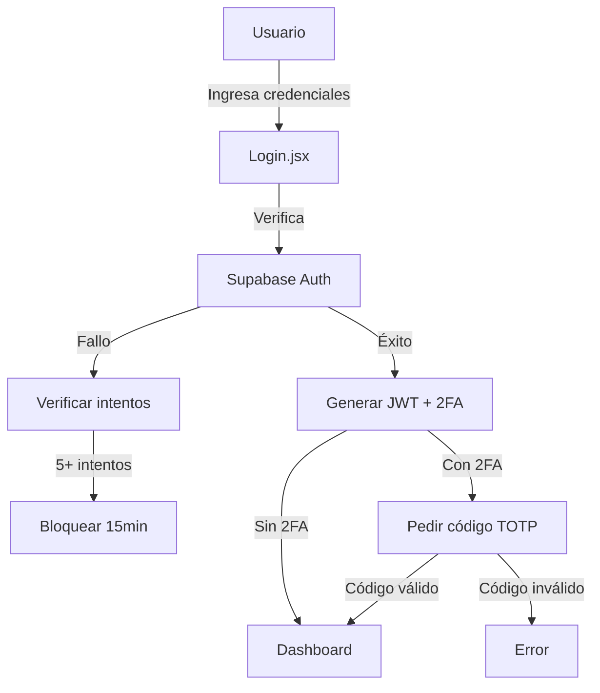
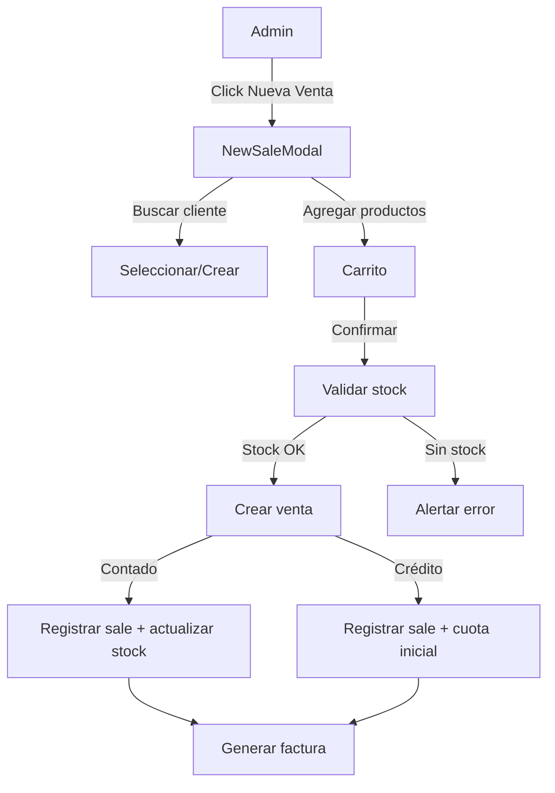

# Plan Integral de Mejoras - Luxessence Web

## 1. Estado Actual del Proyecto

### 1.1 Tecnologías y Dependencias
- **Frontend**: React 19 + Vite 7
- **Estilos**: Tailwind CSS 4, Framer Motion
- **Backend**: Supabase (Auth, Database)
- **Librerías**: react-router-dom, recharts, xlsx, html-to-image, react-to-print, lucide-react

### 1.2 Estructura de Archivos Actual
```
src/
├── components/
│   ├── admin/
│   │   ├── AdminLayout.jsx (198 líneas)
│   │   ├── InvoiceTemplate.jsx
│   │   ├── Pagination.jsx
│   │   └── SecurityModal.jsx
│   ├── ui/
│   └── ...
├── pages/
│   ├── admin/
│   │   ├── Dashboard.jsx (378 líneas)
│   │   ├── SalesHistory.jsx (664 líneas)
│   │   ├── CustomerManagement.jsx (335 líneas)
│   │   ├── OrderManagement.jsx
│   │   ├── ProductManagement.jsx
│   │   ├── Login.jsx
│   │   └── ...
│   └── ...
├── context/
├── lib/
└── utils/
```

### 1.3 Base de Datos (Supabase)
- **Tablas**: categories, products, customers, orders, sales, payments
- **RLS**: Deshabilitado actualmente

---

## 2. Análisis de Problemas Identificados

### 2.1 Seguridad (CRÍTICO)
| Problema | Ubicación | Impacto |
|----------|------------|---------|
| Contraseña hardcodeada "1234" | [`SecurityModal.jsx:11`](src/components/admin/SecurityModal.jsx:11) | Vulnerabilidad crítica |
| Sin autenticación de dos factores (2FA) | Sistema completo | Bajo |
| Almacenamiento de sesión en localStorage | [`AdminLayout.jsx:12`](src/components/admin/AdminLayout.jsx:12) | Medio |
| Sin protección CSRF | App completa | Medio |
| RLS deshabilitado en Supabase | [`supabase_schema.sql:64`](supabase_schema.sql:64) | Alto |

### 2.2 Código y Rendimiento
| Problema | Impacto |
|----------|---------|
| Archivos muy grandes (SalesHistory.jsx: 664 líneas) | Mantenibilidad |
| Queries sin paginación eficiente | Rendimiento |
| Sin código muerto eliminado | Tamaño bundle |
| Dependencias desactualizadas potenciales | Seguridad |

### 2.3 Funcionalidad
| Problema | Estado |
|----------|--------|
| Crear ventas desde panel admin | **NO EXISTE** |
| Asignar cliente a venta manual | **NO EXISTE** |
| Sistema de permisos/roles | Básico |
| Protección contra fuerza bruta | **NO EXISTE** |

---

## 3. Plan de Implementación por Prioridad

### FASE 1: Seguridad Crítica (Semana 1)

#### 1.1 Eliminar contraseña hardcodeada
```javascript
// Reemplazar en SecurityModal.jsx
// Antes: if (password === '1234')
// Después: Verificar contra Supabase Auth del admin
```

#### 1.2 Implementar 2FA con TOTP
- Generar secretos TOTP por usuario admin
- Validar código de 6 dígitos
- Almacenar en tabla separada de Supabase

#### 1.3 Implementar protección contra fuerza bruta
- Limitar intentos de login (5 intentos/15min)
- Registrar intentos fallidos
- Bloqueo temporal de IP

#### 1.4 Habilitar RLS en Supabase
```sql
-- Políticas de acceso por tabla
ALTER TABLE products ENABLE ROW LEVEL SECURITY;
CREATE POLICY "Admin only" ON products FOR ALL USING (auth.role() = 'authenticated');
```

#### 1.5 Mejorar gestión de sesiones
- Usar cookies segurasHttpOnly en lugar de localStorage
- Implementar refresh tokens
- Session timeout (30 min inactivity)

### FASE 2: Módulo de Ventas Admin (Semana 2)

#### 2.1 Crear componente NewSaleModal
```jsx
// src/components/admin/NewSaleModal.jsx
// Funcionalidades:
// - Seleccionar cliente existente o crear nuevo
// - Buscar y agregar productos del inventario
// - Calcular total, descuento, método de pago
// - Generar registro en tabla 'sales'
```

#### 2.2 Agregar botón en SalesHistory
- Floating action button o en header
- Abrir NewSaleModal

#### 2.3 Flujo de trabajo
1. Admin busca/selecciona cliente
2. Busca productos por nombre/categoría
3. Agrega al carrito de venta
4. Aplica descuento (%)
5. Selecciona método: Contado/Crédito
6. Confirma venta → Crea:
   - Registro en `sales`
   - Actualiza `stock` de productos
   - Si crédito → registra primera cuota

### FASE 3: Limpieza y Optimización (Semana 3)

#### 3.1 Reestructurar archivos grandes
- Extraer lógica de SalesHistory a hooks
- Crear componentes reutilizables para modales
- Separar lógica de presentación

#### 3.2 Optimizar queries
```javascript
// Implementar paginación en todas las tablas
const { data } = await supabase
  .from('products')
  .select('*')
  .range(offset, offset + limit);
```

#### 3.3 Eliminar código muerto
- Remover imports sin usar
- Eliminar funciones deprecated

#### 3.4 Optimizar bundle
- Code splitting con React.lazy
- Lazy loading de imágenes

### FASE 4: Escalabilidad (Semana 4)

#### 4.1 Implementar sistema de roles
```sql
CREATE TABLE admin_users (
  id UUID PRIMARY KEY REFERENCES auth.users(id),
  role TEXT CHECK (role IN ('super_admin', 'manager', 'cashier')),
  created_at TIMESTAMPTZ DEFAULT NOW()
);
```

#### 4.2 Optimizar base de datos
- Agregar índices compuestos
- Implementar cache con React Query
- Database functions para operaciones complejas

#### 4.3 Documentación
- Documentar API interna
- Crear guía de contribución

---

## 4. Recomendaciones de Ejecución

### Prioridad 1 (Inmediato - 1 semana)
1. ✅ Cambiar contraseña hardcodeada
2. ✅ Habilitar RLS en Supabase
3. ✅ Implementar rate limiting en login

### Prioridad 2 (Esta semana - 2 semanas)
1. ✅ Crear módulo de ventas administrativas
2. ✅ Agregar selección de clientes en admin

### Prioridad 3 (2-3 semanas)
1. ✅ Refactorizar archivos grandes
2. ✅ Optimizar queries
3. ✅ Implementar paginación eficiente

### Prioridad 4 (3-4 semanas)
1. ✅ Sistema de roles
2. ✅ 2FA
3. ✅ Documentación

---

## 5. Diagramas de Arquitectura

### 5.1 Flujo de Autenticación Propuesto


### 5.2 Flujo de Venta Administrativa


---

## 6. Archivos a Modificar

| Archivo | Acción | Líneas aprox |
|---------|--------|--------------|
| `src/components/admin/SecurityModal.jsx` | Reescribir autenticación | 95 |
| `src/pages/admin/Login.jsx` | Agregar rate limiting | 101 |
| `src/components/admin/AdminLayout.jsx` | Mejorar logout + sesiones | 198 |
| `src/pages/admin/SalesHistory.jsx` | Extraer a componente | 664 → 200 |
| **NUEVO** `src/components/admin/NewSaleModal.jsx` | Crear módulo ventas | ~400 |
| **NUEVO** `src/hooks/useAuth.js` | Hook de autenticación | ~100 |
| **NUEVO** `src/hooks/useSales.js` | Hook de ventas | ~150 |
| `supabase_schema.sql` | Agregar tablas y RLS | 65 → 150 |

---

## 7. Próximos Pasos Inmediatos

1. **Confirmar plan** con el usuario
2. **Iniciar implementación** de Fase 1 (Seguridad)
3. **Crear módulo de ventas** en Fase 2
4. Continuar según prioridades establecidas

---

*Documento generado automáticamente para el proyecto Luxessence Web*
*Fecha: 2026-02-26*
